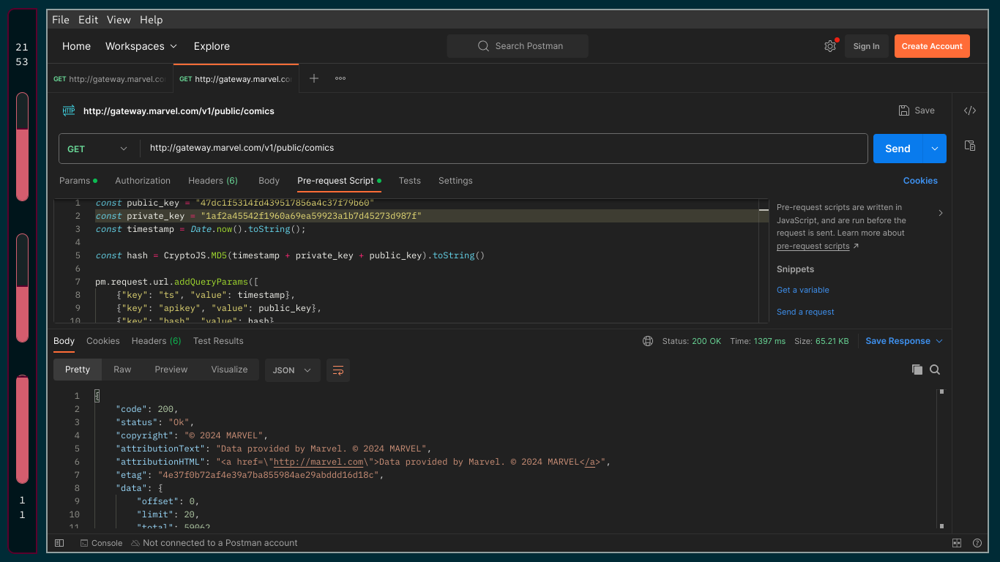
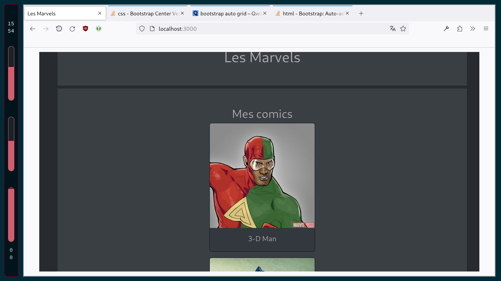
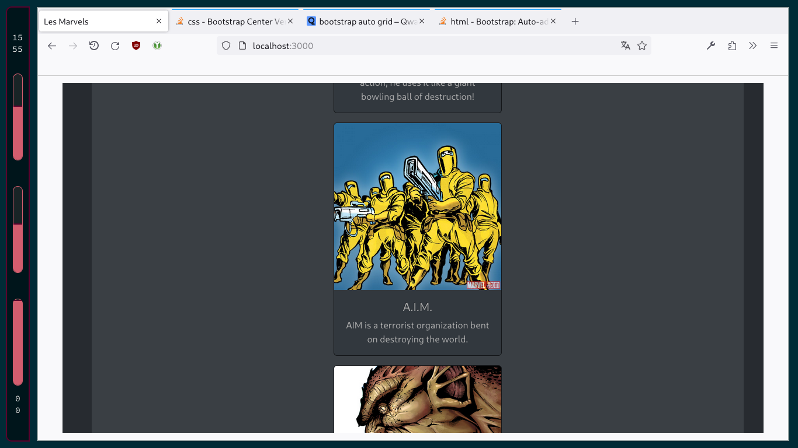

# Rapport 

## Introduction 

J'ai effectué toutes les étapes (1 à 5) du TP. J'ai donc créé une application
sur nodejs qui récupère des informations sur des personnages de comics avec de
l'API de Marvel, et qui les affiche sur une serveur grâce à fastify et
handlebars. J'ai aussi créé un Dockerfile pour qu'une image de cette application
puisse être créé.

## Étapes 1 et 2 

Pour explorer l'API, j'ai rajouté une `pre-request script` pour permettre à
`postman` de faire des requêtes authentifié à l'API de Marvel. Après avoir
cherché dans la documentation de `postman`, la méthode la plus simple que j'ai
trouvé à été de modifier directement la requête grâce à la librairie de
`postman`.

**Pre-request script** :
```js
const public_key = "clef publique"
const private_key = "clef privée"
const timestamp = Date.now().toString();

const hash = CryptoJS.MD5(timestamp + private_key + public_key).toString()

// Syntaxe spécifique à postman pour rajouter des paramètres à la requête.
pm.request.url.addQueryParams([
    {"key": "ts", "value": timestamp},
    {"key": "apikey", "value": public_key},
    {"key": "hash", "value": hash},
])
```

**Résultat d'une requête authentifié avec postman sur l'API Marvel**:


## Étapes 3 à 5 

### API request | Extraction des données 

Pour extraire les données depuis l'API Marvel, je fais une requête asynchrone avec
`node-fetch`. J'utilise `dotenv` pour sécuriser mes clefs d'authentification
dans une fichier `.env`, et j'utilise `node:crypto` pour calculer le hash
d'authentification requis.

**Récupération des données** : 

```js
export const getData = async (url) => {

    const query_url = new URL(url)
    const timestamp = Date.now().toString();

    # Récupétation des secrets avec dotenv
    const public_key = process.env.PUB_KEY
    const private_key = process.env.PRIV_KEY

    const hash = getHash(public_key, private_key, timestamp)

    # Ajout des parametres pour authentifier la requête
    query_url.searchParams.append("ts", timestamp)
    query_url.searchParams.append("apikey", public_key)
    query_url.searchParams.append("hash", await hash)

    # Requête avec node-fetch
    const response = await fetch(query_url)
    const data = await response.json()

    //...
}
```

**Calcul du hash** : 

```js
export const getHash = async (publicKey, privateKey, timestamp) => {
    return createHash("md5")
    .update(timestamp + privateKey + publicKey)
    .digest("hex");
}
```

### Data pipeline | Traitement des données 

Pour traiter les données, j'ai codé de manière fonctionnelle pour faire une
sorte de data pipeline avec des `map` et des `filter`. J'ai séparé les
différentes étapes de la pipeline en différentes variables pour les rendres plus
clair, même si j'aurais très bien pu tout combiner en une expression.

```js 
async function getData(url){
    //... initialisation de la fonction 

    const heros_with_images = data.data.results.filter(character => !character.thumbnail.path.endsWith("image_not_available"))

    const heros_without_description = heros_with_images.map(character => {
        return {
            name: character.name,  imageUrl: character.thumbnail.path + "." + character.thumbnail.extension,
            description: character.description
        }
    })

    const heros_with_optional_description = heros_without_description.map(
        // Ajout de description si la description n'est pas vide
        //...
    )

    return heros_with_optional_description
}

```

### Templating engine | Affichage 

Pour afficher les personnages, j'ai utilisé l'engine de templating handlebars
pour manipuler les données extraites. J'ai aussi utilisé les cards bootstraps
pour définir leur affichage, car je trouvais cela plus propre que des simples `li`.

**Affichage des personnages** :
```html
<div class="d-grid justify-content-center gap-3">
    <!--- Boucke for each sur les personnages--->
    {{#each personnes}}

        <!--- Card bootstrap pour afficher un personnage --->
        <div class="card" style="width: 18rem;">
          
          <div class="card-body">
            <h5 class="card-title">{{name}}</h5>


            <!--- Condition handlebars pour afficher les descriptions --->
            {{#if description}}
                <p class="card-text">{{description}}</p>
            {{/if}}

          </div>
        </div>

    {{/each}}
</div>
```

**Résultat de l'affichage des personnages** :



## Ce que j'ai appris

### Nouveaux outils techniques 

Pour explorer l'API Marvel, j'ai appris à utiliser des fonctionnalités plus avancées de Postman, comme les pre-request scripts. 

Au niveau de l'affichage, j'ai déjà utilisé auparavant des templating engines pour des applications JavaEE avec des fichiers JSP, et pour la création de blogs statiques avec `hugo` et `zora`. Ce TP m'a donc permis de me familiariser avec la syntaxe de Handlebars sans trop de difficultés.

J'ai déjà manipulé des images et des conteneurs Docker pour utiliser certains outils dans mes projets. Je n'avais cependant jamais créé d'image, et c'est ce TP qui m'a permis de vraiment comprendre la mise en place et l'utilisation de Docker.

J'ai déjà manipulé des images et des containers dockers pour utiliser certains outils dans mes projets. Je n'avais cependant jamais créé d'image, et c'est ce TP qui m'as permis de vraiment comprendre la mise en place et l'utilisation de docker.

## Conclusion 

J'ai terminé ce TP en plus de temps que le premier, surtout parce qu'il fallait se familiariser avec beaucoup de concepts en même temps comme l'utilisation plus avancée de postman, l'utilisation de l'API marvels, et surtout la mise en place d'une image docker.

Je pense cependant avoir acquis une bonne maitrise des concepts abordé.

## Docker cheatsheet 

### Lancement de l'application 

```Sh
# Pour créer un image `img`
docker build . -t img

# Pour lancer un container basé sur l'image
docker run -p 8080:3000 img
```

### Gestion des containers 

```Sh
# Pour afficher tout les containers de la machine 
docker ps -a

# Pour arrêter un container 
docker stop container_id

# Pour supprimer un container de la machine 
docker rm container_id
```

